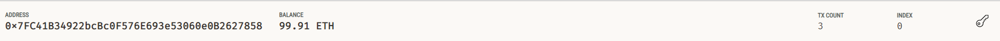

# challenge_19_072723
---
# Fintech Finder 
### Using Ganache and Python to create an app that allows a user to transfer funds between two crypto wallets
---
## Objective

This assignment aims to create an app that allows customers to review fintech professionals' ratings and enables the customer to send cryptocurrency payments to the fintech professionals.

To accomplish this and test it in a practice environment. **Ganache** is a program that allows you to quickly set up a local blockchain, which you can use to test and develop smart contracts. As a simulated user, I used Ganache to create a crypto wallet. I could then determine how many hours I wanted the fintech professional to work and calculate how much Ethereum crypto I needed to pay that professional.

---
## Technologies
1. python
2. [Ganache](https://trufflesuite.com/ganache/)
3. Streamlit - User interface to select a fintech professional and determine the hours to pay that professional
4. Web3 - a Python library for connecting to and performing operations on Ethereum-based blockchains
5. Mnemonic - used within a .env file to connect to the Ethereum wallet

---
## Run Instructions
Once you've downloaded the file, you'll have a few things to do for setup.

1. Download and install Ganache on your local machine
2. Install Web3 
3. Install Streamlit
4. Install bip44 

Once you've installed the required packages, you must change the URL in the 'fintech_finder.py' file to include your Ganache server. 

Finally, at your command prompt, navigate to where you've cloned the file, then type in the following command:
```
streamlit run fintech_finder.py
```
---
## Results

The following images show examples where I selected and then paid three individual fintech professionals. I successfully transferred funds from my Ethereum wallet to their Ethereum wallet. 

The following image shows the initial Streamlit app page.


The image below shows the blockchain transactions in Ganache.


Image showing the transaction history from Ganache


Finally, the image below shows the balance in my Ethereum wallet.


